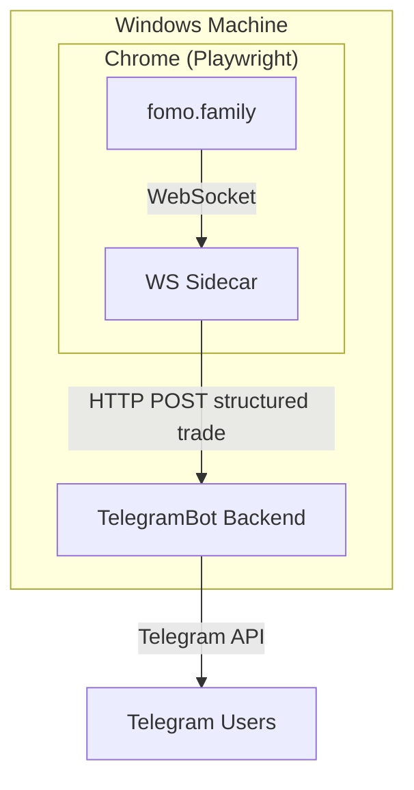

# FomoFaster WS

Real-time FOMO trade notifications to Telegram, sourced directly from the FOMO WebSocket feed.

## Architecture



## Components

| Folder | Purpose |
|--------|---------|
| `ws-sidecar/` | Node.js + Playwright process that opens fomo.family in Chrome, intercepts the `wss://prod-api.fomo.family/ws` WebSocket feed, transforms trade events into structured JSON, and POSTs them to the backend. |
| `telegram-bot/TelegramBot/` | C# backend that receives structured trade notifications, stores them in SQLite, and sends formatted messages to Telegram subscribers. Contract address, chain, and market cap arrive pre-resolved — no lookup needed. |

## Prerequisites

- **.NET 8.0 SDK**
- **Node.js 20+**
- **Google Chrome** (installed — Playwright drives your real Chrome, not a bundled browser)

## Setup

### 1. Create Telegram Bot
Message [@BotFather](https://t.me/BotFather) → `/newbot` → follow prompts → copy token.

### 2. Configure Backend

Edit `telegram-bot/TelegramBot/appsettings.json` and fill in:

```json
{
  "Telegram": {
    "BotToken": "YOUR_BOT_TOKEN",
    "AdminBotToken": "YOUR_ADMIN_BOT_TOKEN",
    "OwnerUserId": YOUR_TELEGRAM_USER_ID
  },
  "Helius": {
    "ApiKey": "YOUR_HELIUS_API_KEY"
  }
}
```

### 3. Run Backend

```cmd
cd telegram-bot\TelegramBot
dotnet run
```

Should show:
```
Now listening on: http://0.0.0.0:8000
```

### 4. Install Sidecar Dependencies

```cmd
cd ws-sidecar
npm install
npx playwright install chromium
```

### 5. Run Sidecar

```cmd
cd ws-sidecar
npm start
```

Chrome opens and navigates to `fomo.family`. **On first run**, log in with your FOMO account. The session is saved to `ws-sidecar/chromium-profile/` and persists — you never have to log in again.

Once logged in the sidecar prints:
```
[main] Sidecar running — intercepting WS trade events
[intercept] WebSocket opened: wss://prod-api.fomo.family/ws
```

Trades will start flowing to Telegram immediately.

## Running Both Together

Open two terminals:

```cmd
# Terminal 1 — backend
cd telegram-bot\TelegramBot
dotnet run

# Terminal 2 — sidecar
cd ws-sidecar
npm start
```

## Project Structure

```
fomofaster-ws/
├── ws-sidecar/
│   ├── src/
│   │   ├── index.ts          # Browser lifecycle, reconnect on crash, heartbeat
│   │   ├── ws-intercept.ts   # Playwright WebSocket frame filter
│   │   ├── transform.ts      # Raw WS payload → StructuredNotificationRequest
│   │   └── client.ts         # HTTP client — POSTs to backend + heartbeat
│   ├── chromium-profile/     # Persistent Chrome session (gitignored)
│   ├── package.json
│   └── tsconfig.json
├── telegram-bot/
│   └── TelegramBot/
│       ├── Controllers/      # API endpoints (notifications, sidecar heartbeat)
│       ├── Services/         # Telegram, trader, user, payment logic
│       ├── Models/           # Data models + DTOs
│       ├── Data/             # SQLite DB context
│       └── Migrations/       # EF Core migrations
└── README.md
```

## How the Feed Works

FOMO's web app at `fomo.family` connects to `wss://prod-api.fomo.family/ws` and subscribes to `trading_activity` for the authenticated user — this delivers every trade made by traders that user follows, as structured JSON with contract address, chain, USD amount, and market cap already resolved.

The sidecar intercepts these frames at the Playwright level, maps them to a typed `StructuredNotificationRequest`, and POSTs to `POST /api/notifications/structured`. The backend stores the notification and broadcasts to Telegram subscribers — no ticker parsing, no contract address lookups, no retries.
