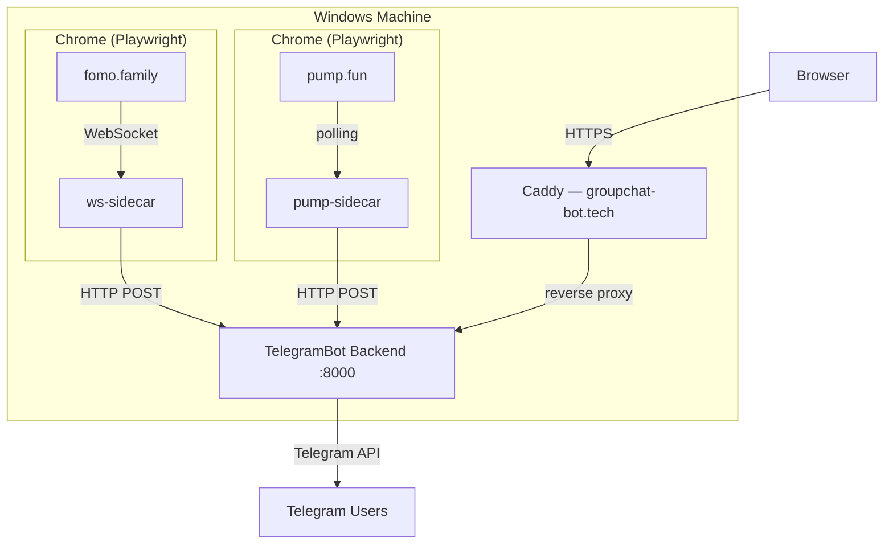

# FomoFaster WS

Real-time trade notifications to Telegram, sourced directly from the FOMO and Pump.fun feeds.

## Architecture


```mermaid
flowchart TB
    subgraph Windows["Windows Machine"]
        subgraph ChromeWS["Chrome (Playwright)"]
            FOMO["fomo.family"] -->|WebSocket| WsSidecar["ws-sidecar"]
        end
        subgraph ChromePump["Chrome (Playwright)"]
            Pump["pump.fun"] -->|polling| PumpSidecar["pump-sidecar"]
        end
        WsSidecar -->|HTTP POST| Backend["TelegramBot Backend :8000"]
        PumpSidecar -->|HTTP POST| Backend
        Caddy["Caddy — groupchat-bot.tech"] -->|reverse proxy| Backend
    end
    Backend -->|Telegram API| Telegram["Telegram Users"]
    Browser["Browser"] -->|HTTPS| Caddy
```

`/manage` is a self-service web page (Telegram Login auth, subscription-gated) where users pick which traders to follow, set per-trader/per-chain alert thresholds, and manage notification settings — the same data the bot's own commands read and write.

## Components

| Folder | Purpose |
|--------|---------|
| `ws-sidecar/` | Node.js + Playwright process that opens fomo.family in Chrome, intercepts the `wss://prod-api.fomo.family/ws` WebSocket feed, transforms trade events into structured JSON, and POSTs them to the backend. |
| `pump-sidecar/` | Node.js + Playwright process that polls pump.fun for followed-trader activity (callouts, reposts, replies) and POSTs structured events to the backend. |
| `telegram-bot/TelegramBot/` | C# backend — Telegram bot, structured-notification ingestion, SQLite storage, and the API behind `/manage` and `/dashboard`. |
| `deploy/` | `Caddyfile` — reverse proxy config that terminates TLS for `groupchat-bot.tech` and exposes only `/manage` and its API, nothing else. |

## Prerequisites

- **.NET 8.0 SDK**
- **Node.js 20+**
- **Google Chrome** (installed — Playwright drives your real Chrome, not a bundled browser)

## Setup

### 1. Create Telegram Bot
Message [@BotFather](https://t.me/BotFather) → `/newbot` → follow prompts → copy token.

### 2. Configure Backend

Edit `telegram-bot/TelegramBot/appsettings.json` and fill in:

```json
{
  "Telegram": {
    "BotToken": "YOUR_BOT_TOKEN",
    "AdminBotToken": "YOUR_ADMIN_BOT_TOKEN",
    "OwnerUserId": YOUR_TELEGRAM_USER_ID
  },
  "Helius": {
    "ApiKey": "YOUR_HELIUS_API_KEY"
  }
}
```

### 3. Run Backend

```cmd
cd telegram-bot\TelegramBot
dotnet run
```

Should show:
```
Now listening on: http://0.0.0.0:8000
```

### 4. Install & Run the Sidecars

Same steps for both `ws-sidecar/` and `pump-sidecar/`:

```cmd
cd ws-sidecar
npm install
npx playwright install chrome
npm start
```

Chrome opens to the target site. **On first run**, log in by hand — the session is saved to `chromium-profile/` (gitignored) and persists after that.

### 5. Reverse Proxy (optional, needed for `/manage`)

`/manage` uses the Telegram Login Widget, which requires HTTPS on a real domain. Point DNS at this machine, then run Caddy with `deploy/Caddyfile` — it auto-provisions TLS and only forwards `/manage`, `/api/auth/*`, and `/api/manage/*`. Everything else on the backend stays unreachable from outside.

## Running Everything

`start-all.bat` launches the backend and both sidecars, each in its own window. Individual `start-*.bat` scripts exist per component.

## Project Structure

```
fomofaster-ws/
├── ws-sidecar/          # FOMO WebSocket interceptor
├── pump-sidecar/        # Pump.fun poller
├── telegram-bot/
│   └── TelegramBot/     # C# backend + /manage and /dashboard web pages
├── deploy/              # Caddy reverse proxy config
└── README.md
```

## How the Feeds Work

**FOMO**: `fomo.family` connects to `wss://prod-api.fomo.family/ws` and subscribes to `trading_activity` for the authenticated user — every trade made by traders that user follows, as structured JSON with contract address, chain, USD amount, and market cap already resolved. `ws-sidecar` intercepts these frames at the Playwright level and POSTs to `/api/notifications/structured`.

**Pump.fun**: has no equivalent WebSocket feed, so `pump-sidecar` polls the authenticated account's alerts endpoint instead, transforms callout/repost/reply events, and POSTs to `/api/notifications/pump-structured`.

Either way: no ticker parsing, no contract address lookups, no retries — the backend stores the notification and broadcasts to Telegram subscribers.
